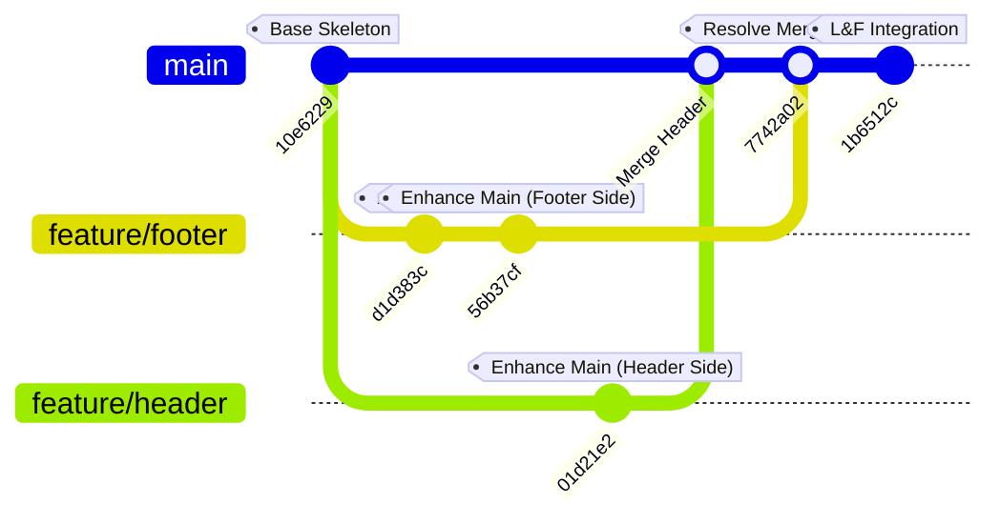

# Version Control & Web Design Simulation: Workflow, Challenges, and Takeaways

This repository houses a simulation project designed to master Git version control workflows and modern responsive web design. The project centers around a landing page that details course learning objectives and Git fundamentals.

---

## 🗺️ The Git Workflow

The project was developed using a branching strategy to simulate concurrent development by multiple team members on the same codebase. 

Below is a visualization of the git branch history and merge flow:



### Chronological Commit Breakdown
1. **`10e6229` (Added header and main section to index.html)**: Established the core HTML skeleton, outlining the document structure.
2. **`d1d383c` (Added footer section to index.html)**: Developed on the `feature/footer` branch, adding footer navigation and credentials.
3. **`01d21e2` (Enhancing the main section using header branch)**: Developed on the `feature/header` branch, modifying the main content area with detailed descriptions.
4. **`56b37cf` (Add more details to main section using footer branch)**: Concurrently developed on the `feature/footer` branch, editing overlapping parts of the main content area.
5. **`7742a02` (Fix merge conflict)**: Integrated both branches. Because both branches modified overlapping sections of the same file (`index.html`), Git raised a conflict, which was resolved manually.
6. **`1b6512c` (Index page updated and integration of L&F for Review)**: Integrated style enhancements (`styles.css`) for a polished Look and Feel (L&F).

---

## ⚡ Challenges Faced & Solutions Implemented

### 1. Concurrent Code Modifications & Overlapping Commits
* **The Challenge**: Both `feature/header` and `feature/footer` branches modified the `<main>` and content sections of [index.html](file:///c:/perscholas/2026-RTT-27/version-control-simulation-MamadouMoussaBalde/index.html).
* **The Solution**: Used distinct feature branches (`feature/header` and `feature/footer`) branching off the main skeleton commit (`10e6229`) to keep features isolated during development.

### 2. Resolving Git Merge Conflicts
* **The Challenge**: Attempting to merge `feature/footer` and `feature/header` back into `main` resulted in a conflict in [index.html](file:///c:/perscholas/2026-RTT-27/version-control-simulation-MamadouMoussaBalde/index.html). The differences in content within the main section confused Git's automated merge engine.
* **The Solution**: 
  1. Opened the conflicted file to find the conflict markers:
     ```html
     <<<<<<< HEAD
     [Changes from Branch A]
     =======
     [Changes from Branch B]
     >>>>>>> branch-b
     ```
  2. Manually merged the edits, keeping the new header/main content from one branch and the list of course objectives from the other.
  3. Staged the resolved file (`git add index.html`) and finalized the merge with a merge commit (`7742a02`).

### 3. Integrating a Modern, Responsive "Look & Feel" (L&F)
* **The Challenge**: The basic HTML layout looked unstyled. It needed to be upgraded to a clean, user-friendly, responsive interface that follows modern design aesthetics without using TailwindCSS.
* **The Solution**: Implemented a CSS system in [styles.css](file:///c:/perscholas/2026-RTT-27/version-control-simulation-MamadouMoussaBalde/styles.css):
  * **Design System & Custom Properties**: Setup a `:root` variable configuration for typography and colors (using slate and sky-blue hues).
  * **Typography**: Imported and applied the Google Font *Outfit* to elevate readability.
  * **Layouts**: Employed Flexbox for navigation/welcome sections and CSS Grid with `repeat(auto-fit, minmax(...))` for course objective listings.
  * **Micro-animations**: Included CSS transitions, hover scale effects, and underline expanders for interactive items.
  * **Responsiveness**: Coded media queries that stack columns on mobile viewports ($\le 768\text{px}$) to guarantee accessibility.

---

## 🔑 Key Takeaways

> [!NOTE]
> **Commit Early and Often**
> Small, atomic commits with clear messages (e.g., separating header design from styling) make it much easier to pinpoint changes and rollback if issues arise.

> [!TIP]
> **Branching is a Best Practice**
> Never work directly on the `main` branch. Creating short-lived feature branches protects the stability of the production-ready code.

> [!IMPORTANT]
> **Merge Conflicts are Natural**
> Merge conflicts are a normal part of collaboration. Understanding how to read conflict markers and safely integrate overlapping code is a core skill for any developer. Keep communication channels open with teammates when resolving conflicts in shared components.

---

## 🧠 Workflow Reflection

In this simulation, managing branches systematically was the foundational step to mimicking a real-world team environment. I created separate, dedicated feature branches—specifically `feature/header` and `feature/footer`—using the `git branch` command and checked them out using `git checkout`. This setup ensured that changes to different parts of the webpage were completely isolated, preventing developers from overwriting one another's active work. Employing these logical naming conventions helped categorize, organize, and track the progress of each feature independently before any integration occurred.

The critical phase of the simulation occurred when merging these feature branches back into the central `main` branch. Because both branches modified the `<main>` section of `index.html` concurrently, Git's automatic merge engine flagged a merge conflict. To resolve this issue, I opened the conflicted file in my editor, located the standard conflict markers (`<<<<<<<`, `=======`, and `>>>>>>>`), and carefully analyzed the overlapping lines of code. Rather than choosing one version over the other and losing valuable work, I combined the structural elements from both branches—incorporating both the enhanced descriptions and the objective lists—before deleting the markers, staging the file, and finalizing the merge commit.

Finally, the pull request (PR) process was essential to ensuring long-term code quality and healthy team collaboration. Even in this simulated environment, treating merges as formal pull requests mimicked the professional code review stage, which acts as a critical quality checkpoint. PRs allow team members to review line-by-line differences, run automated tests, and catch visual bugs or styling inconsistencies before code enters production. This gatekeeping mechanism prevents broken layout code from reaching the main branch, encourages open peer discussion regarding implementation details, and promotes team alignment on CSS and HTML coding standards. Overall, this simulation workflow underscored that version control is not just a tool for saving individual progress, but the absolute foundation for team communication, quality assurance, and modern collaborative development.

